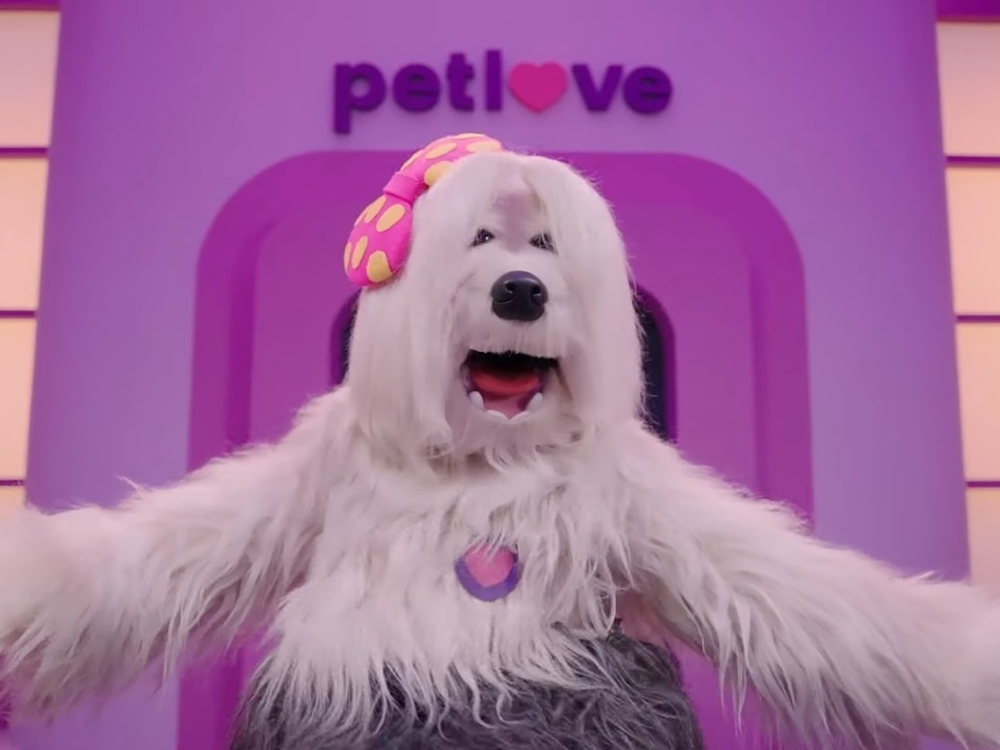
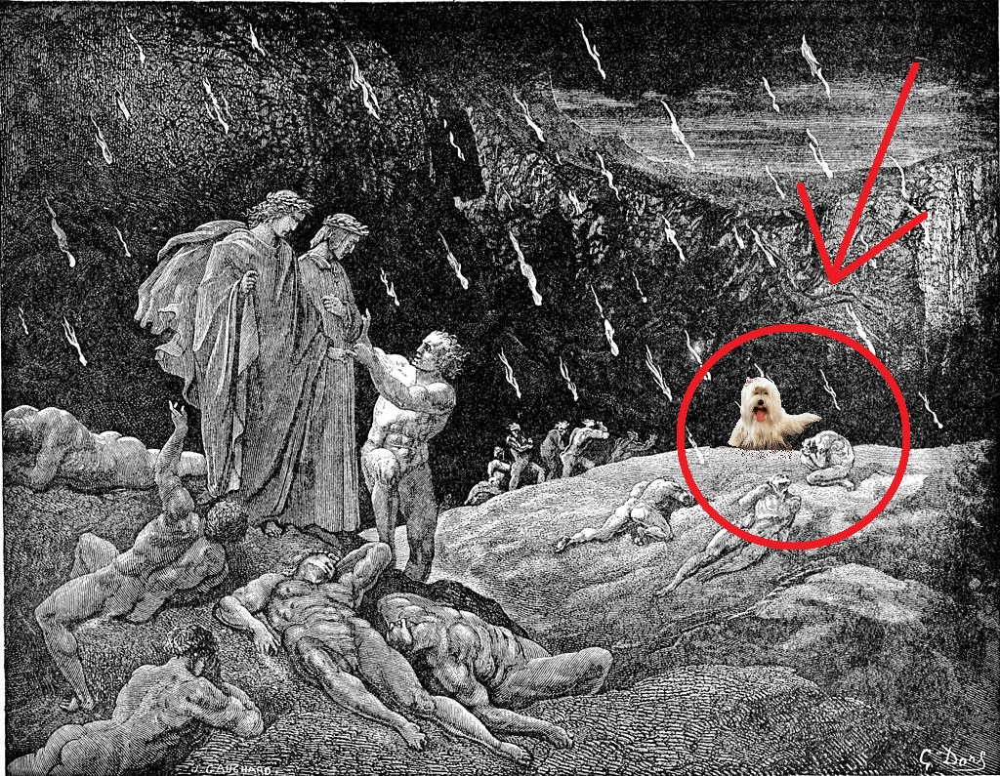

# Case Petlove - Intelig Mercado
 

## Overview

As of 2022, Petlove is the biggest online petshop in Brazil. This project is based on the Technical Challenge Case from their Intelligence sector. Despite their astounding success on the market for the previous couple of decades, 
Petlove's marketing department took a risky choice when it decided to cast Priscila, the main character from Brazilian children's television series TV Colosso (also known abroad as *The Hot Dog Channel*), as their company mascot.

The American novelist Nathaniel Hawthorne once presciently declared that "There are many things in this world that a child must not ask about", but little did he know the scarring that Priscila would inflict in the yet fragile
psyches of unsuspecting brazilian children of the 90s. Despite the desperate attempts from the makeup team, the truth is hidden beneath the black veneer of Priscila's souless eyes, as seen here on her/it original appearance.

 

Described by their stygian makers as "a charming female sheepdog, main and only producer of the Hot God Channel", Priscila is actually a fiendish hellhound summoned from the the Third Ring of the Seventh Circle of hell, *allegedly*
reserved for those who commit violence against God, Art and Nature. She is depicted in Gustave Doré's engraving "Canto XV", torturing the damned while Dante and Virgil continue their journey on the foreground. 

Despite the caustic poison that seeps into our very souls by simply reading her name, I have decided to try my hand at solving the enigmas hidden deep in this so-called "Case".
If you _must_ know the results from my search, carry on: steel your mind, but remember that overconfidence is a slow   and insidious   killer.

---

## Project objective

IN PROGRESS. (run while you can)

## Technologies

- Python 3.8.13
	- Pandas 1.4.4
	- Numpy 1.20.3
	- Pycaret 2.3.10
	- Seaborn 0.11.2
	- Matplotlib 3.5.3
	- SQLAlchemy 1.4.42
	- Scikit-learn 1.1
- MySQL 8.0
- Tableau 2022.3

## Project Description

## Steps

## Conclusion